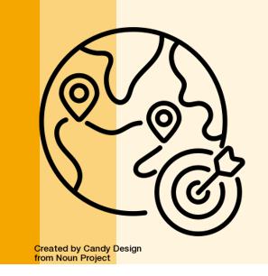

::: {.section-label}
Open Educational Resource
:::

## Adapting This Course

::: {.section-intro}
This course is designed to be adopted and adapted by Higher Education Institutions worldwide.
Everything here (sessions, slides, lecture notes, assessment designs) is published under CC BY-NC-SA 4.0.
You are free to take what you need, leave what you don't, and build something suitable for your own
needs and context, for non-commercial purposes and under the same license.
This page explains how.
:::

---

::: {.adapt-grid}

::: {.adapt-card}
### 1. Use individual sessions

You do not need to run the whole course. Any session can stand alone as a guest lecture,
workshop module, or seminar input. Each session page is self-contained with learning objectives,
materials, tasks, recommended readings, and facilitation notes including globe icons marking
where content can be adapted to your own context (see point 2).

**How**: Download the session QMD file from GitHub, or copy the content into your own course design.
:::

::: {.adapt-card}
### 2. Swap in local case studies

{style="width:48px; height:48px; float:left; margin:0 0.6rem 0.4rem 0;"}
Throughout the slides, this icon marks examples that are meant to be adapted to your own
context (often regional cases from Ethiopia, Kenya, or Switzerland, or generic global examples).
It flags exactly where a case study and/or example can be swapped out with cases from your own
regional context, without you having to guess.

**How**: Look out for the icon as you go through the slides, and replace the flagged
example with a case from your own regional context. If you develop a strong local example,
please share it via a GitHub pull request so other institutions can benefit.

*Icon: "Geotargeting" by Candy Design, from [Noun Project](https://thenounproject.com/browse/icons/term/geotargeting/) ([CC BY 3.0](https://creativecommons.org/licenses/by/3.0/)).*
:::

::: {.adapt-card}
### 3. Remix and extend

Add sessions, change their sequence, integrate your own assessments, or embed this course
within a larger programme. The Quarto format makes structural edits straightforward.

**How**: Fork the repository. The `_quarto.yml` navigation and `sessions/index.qmd` listing
control the structure. `_variables.yml` lets you update course metadata in one place.
:::

::: {.adapt-card}
### 4. Translate

All materials are licensed for translation. If you translate materials into another language,
please notify the CDE's ESD team ([sustainability.cde@unibe.ch](mailto:sustainability.cde@unibe.ch))
so we can link to your version from the repository.

**How**: Fork the GitHub repository, edit the QMD files, and publish your translated version.
:::

::: {.adapt-card}
### 5. Run a co-taught version

This course was designed for co-teaching across institutions. Bringing participants from
different institutions and disciplines together further strengthens the learning experience
throughout — peer feedback and discussion have the potential to weigh more when they cross
institutional and disciplinary lines rather than staying within one.

**How**: Team up with a partner institution of your choice, or contact CDE's ESD team
([sustainability.cde@unibe.ch](mailto:sustainability.cde@unibe.ch)) if you would like support
finding one.
:::

::: {.adapt-card}
### 6. Contribute back

The course improves when institutions share what they changed and why. Contributions are
welcome: new case studies/examples, updated readings, translations, additional sessions.

**How**: Open an issue or pull request on the [GitHub repository]().
All contributors are acknowledged in the repository's commit history and contributor list.
:::

:::

---

## Technical Setup

The course is built with [Quarto](https://quarto.org) — an open-source scientific publishing system.
You need Quarto installed to render the site locally.

**Quick start:**

```bash
# 1. Clone the repository
git clone https://github.com/CDEteaching/[REPO-NAME].git
cd [REPO-NAME]

# 2. Install Quarto (see https://quarto.org/docs/get-started/)

# 3. Preview locally
quarto preview

# 4. Render to _site/ folder
quarto render
```

Deployment to GitHub Pages is automated via the included GitHub Actions workflow
(`.github/workflows/publish.yml`). Push to `main` and the site rebuilds automatically.

**Editing in RStudio**: Open the project folder in RStudio — it will detect the Quarto project
automatically. Use the Render button to preview individual pages.

---

## Attribution

When using or adapting these materials, please attribute as follows:

> *[Course name]. Developed by the Centre for Development and Environment (CDE), University of Bern,
> and partner institutions. Licensed under [CC BY-NC-SA 4.0](https://creativecommons.org/licenses/by-nc-sa/4.0/).*

A link back to the original repository is appreciated but not required.

---

## Contact

Questions about adaptation, co-teaching, or contributing materials:

**Centre for Development and Environment (CDE)**
University of Bern
[sustainability.cde@unibe.ch](mailto:sustainability.cde@unibe.ch)
[]()

---

::: {.license-banner}
⚖️
<p><strong>Open License.</strong> All materials are published under
<a href="https://creativecommons.org/licenses/by-nc-sa/4.0/" target="_blank" rel="noopener">CC BY-NC-SA 4.0</a>
unless stated otherwise. You are free to share and adapt for non-commercial purposes, with attribution and
under the same license.</p>
:::
